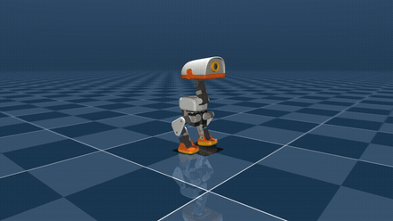
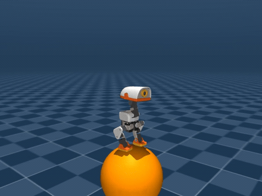

# microduck-mjbatch

Train the [Pollen Microduck](https://github.com/pollen-robotics/microduck) — a ~800 g, ~25 cm
biped — with [mjbatch](https://github.com/kevinzakka/mjbatch): thousands of MuJoCo instances
stepped in parallel on the CPU through a C++ thread pool, GIL released. No CUDA, no GPU.

| walking (`velocity`, solved) | balancing on a ball (`ball-balance`, best-case seed) |
|---|---|
|  |  |

## Quickstart

```bash
uv sync
uv run train_ppo.py --task velocity --num-envs 4096 --iterations 1500 --timestep 0.005
uv run scripts/render_policy.py --policy microduck_policy.pt --command 0.4,0,0 --width 1920 --height 1080
```

## Results

Both tasks on 8 vCPU — the RTX 2080 Ti in this box was never used.

| task | command | wall clock | policy | video |
|---|---|---|---|---|
| `velocity` | `--num-envs 4096 --iterations 1500` | **2 h 36 min** | `microduck_policy.pt` | `media/microduck_walk_1080p.mp4`, [slow motion](media/microduck_walk_slowmo_1080p.mp4) |
| `ball-balance` | `--num-envs 4096 --iterations 800` | **1 h 29 min** | `microduck_ball_policy.pt` | `media/microduck_ball_best.mp4` (10 s), `media/microduck_ball_typical.mp4` (2.2 s) |

**`velocity`: solved.** Final reward 4.10, velocity tracking 0.95, zero falls. Asked for 0.3 m/s it
walks 0.21 m/s steadily; asked for nothing it stands; asked to turn it turns in place.

**`ball-balance`: half-solved, reported as is.** Final reward 6.09 — upright 0.97, height 0.98, but
the ball term only 0.28 and 78 % of episodes still end in a fall. Deterministic evaluation, 64
episodes, 10 s cap:

| | median survival | mean | longest | mean ball offset |
|---|---|---|---|---|
| hold the stand pose | 0.60 s | 0.64 s | 1.22 s | — |
| trained policy | **2.03 s** | 4.12 s | 10.00 s (cap) | 5.1 cm |

So it learns to stand on the ball and to catch it for a few seconds, not to keep it. The gif above
is a best case: `--seed 8`, the duck balances the whole 10 s and the episode only ends on the
episode cap. The other clip is the median case, `--seed 25`, which ends at 2.18 s because the ball
reaches 0.20 m away from the midpoint of the feet and rolls out — the duck itself is still upright
(tilt 0.000, base 0.393 m). Two different seeds, same policy, same command:

```bash
uv run scripts/render_policy.py --policy microduck_ball_policy.pt --seed 8  --seconds 10 --distance 1.3 --width 1920 --height 1080 --out media/microduck_ball_best.mp4
uv run scripts/render_policy.py --policy microduck_ball_policy.pt --seed 25 --seconds 4  --distance 1.3 --width 1920 --height 1080 --out media/microduck_ball_typical.mp4
```

Likely causes for the gap, untested: 800 iterations is short (upstream config asks for
20 000), the plain `kp=5` PD is slow at the ankle compared with the real motor model, and the ball
carries 0.45 kg against a 0.74 kg duck.

Throughput per PPO iteration (4096 envs × 24 steps = 98 304 env-steps): 6.3 s, of which 5.0 s is
rollout and 1.2 s the update. End to end: 16k env-steps/s.

## Tasks

**`velocity`** — follow a velocity command. Observation: body-frame linear and angular velocity,
projected gravity, joint positions and velocities, last action, command, two-phase gait clock
(56 values). Reward: velocity and yaw-rate tracking, foot-lift gait shaping, posture, uprightness,
height, vertical bounce, action rate, torque, joint limits.

**`ball-balance`** — stand on a basketball and hold it under the feet. A port of
[Motphys MotrixLab](https://github.com/Motphys/MotrixLab)'s `microduck-ball-balance` task, same
reward and termination set: alive, upright, base height at the balanced height, ball under the feet,
default posture, action rate, joint limits, undesired contacts; the episode ends on a low base, a
real tilt, the ball rolling out, a joint far from default, or a joint spinning over 100 rad/s.
Ball radius 0.14 m, mass 0.45 kg.

## Where the speed comes from

1. **`mj_step` calls are what the CPU pays for, not simulated seconds.** At 4096 envs the engine
   does ~110k substeps/s regardless of timestep, so `--timestep 0.005` (200 Hz physics) instead of
   `0.002` buys 2.5× for a coarser contact resolution. Control stays at 50 Hz either way.
2. **Visual meshes cost physics time.** The walking model without its 75 shell meshes steps **2×
   faster** (119k vs 62k substeps/s) even though those geoms have `contype=0`. That is why the
   repo ships two trees.
3. **The update is cheap on CPU.** A 128-wide MLP over 98k samples costs 1.2 s per iteration.

## The vendored model

`scripts/vendor_mjcf.py` copies the robot MJCF out of a
[pollen-robotics/microduck_rl](https://github.com/pollen-robotics/microduck_rl) checkout
(Apache-2.0) into two trees:

| tree | contents | who uses it |
|---|---|---|
| `microduck/` | complete model, 38 meshes, 21 MB | `scripts/render_policy.py` — renders the shell |
| `microduck/lean/` | 75 visual mesh geoms dropped, 4 meshes, 2.9 MB | `train_ppo.py` — 2× the substep rate |

Same physics either way. `scripts/check_vendored.py` asserts both trees take a bit-identical
trajectory to upstream over 200 steps of a control sweep.

## Not modeled (yet)

Upstream trains against a richer plant. Missing here, in the order that matters:

1. BAM actuator models — plain `kp=5, kv=0.3` PD replaces real motor dynamics; the torque ceiling
   is the real one, ±0.96 N·m
2. Backlash and joint encoder bias
3. Domain randomization (friction, mass, latency)
4. The symmetry constraint upstream uses to prevent a limping gait
5. Separate actor and critic observations for `ball-balance` (upstream gives the critic absolute
   ball position and base linear velocity too)

## Layout

```
train_ppo.py               model build, both batched envs, PPO, training loop
microduck/                 vendored MJCF, full tree (2 XML + 38 STL, 21 MB)
microduck/lean/            same model without the visual meshes (4 STL) — training uses this
scripts/vendor_mjcf.py     re-vendor from a microduck_rl checkout
scripts/check_vendored.py  prove the stripping changed no physics
scripts/render_policy.py   offscreen mp4 (or gif) of a checkpoint; --substeps for slow motion
media/                     walking gif / 480p / 1080p / 1080p slow motion, ball-balance best + typical
```

CPU-only environment: `uv sync` (torch from the PyTorch CPU index).
